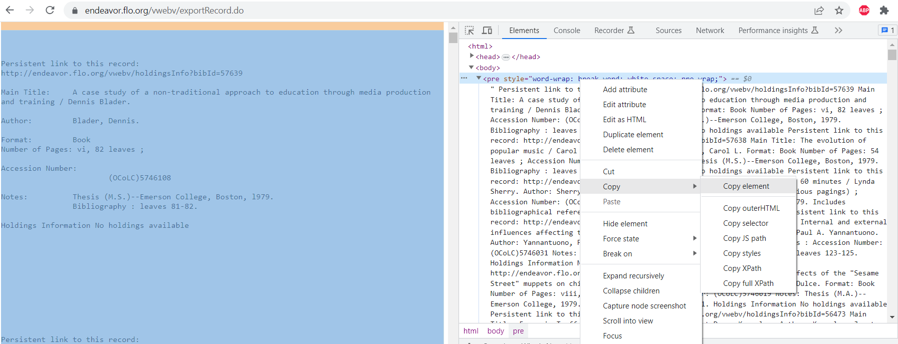
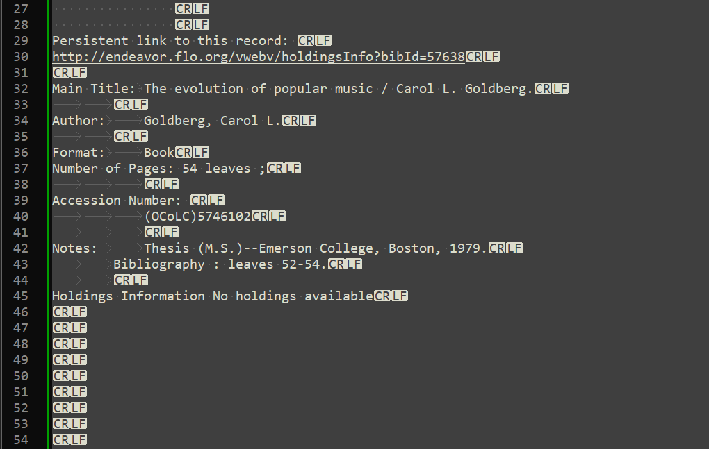
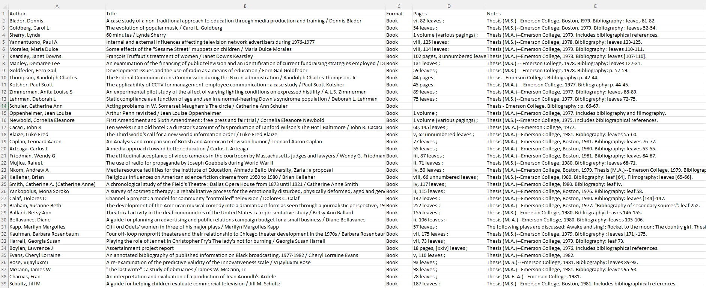

# Flo Parser
This short script converts data scraped from an advanced search on the Fenway Library Organization. Search results need to be exported as an EndNoteWeb Citation. When presented with the exportRecord.do webpage, right click on the page and `inspect` to find the `<body>` of the page. 

Copy the element inside and paste it into a blank text document. Remove any leading lines to make it look like the following entry. Your first line should have the text "Perisistent link to this record:"

Save the file as `webpage.txt` and run `main.py`. Depending on the data consistency and integrity you may have to alter some of the steps in the `Bibliography.parse()` method to clean titles / authors. The script should output an excel file when finished.
